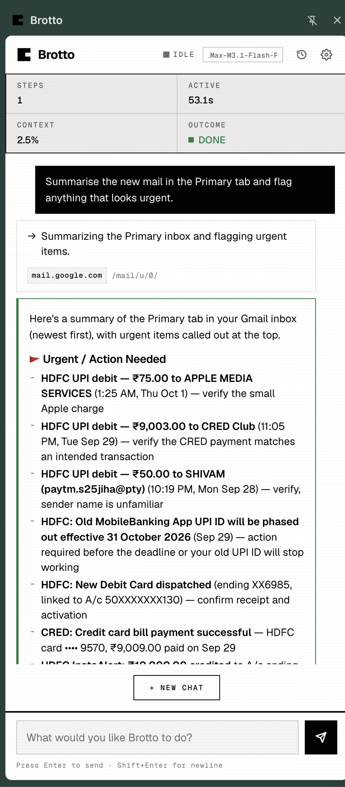

<div align="center">

# Brotto

**Ask an AI to do a task in the browser you're already signed in to.**

It runs in your own Chrome, on your own tabs, with your own cookies.
You bring the model key. There is no Brotto account, and no Brotto server —
you run the orchestrator yourself.

[](https://github.com/suryanshgupta9933/brotto/actions/workflows/ci.yml)
[](LICENSE)
[](clients/brotto-extension)



</div>

<!--
  Video: drop the rendered demo at docs/images/brotto-demo.mp4, then replace this
  block with the <video> tag below. The render is `demo/README.md` — four cuts,
  one per claim, all off the same real panel.

  <video src="docs/images/brotto-demo.mp4" width="720" autoplay loop muted playsinline></video>
-->

**A 25-second demo is rendering.** In the meantime: the panel screenshot above
is the real extension on a real Gmail tab, not a mock-up.

---

## Why your own browser

Most browser agents run in **a cloud browser you have never logged into**. So they have to
re-authenticate, they trip bot detection, and — never having been given your session — they read
the page as a **screenshot**.

That combination falls over on exactly the tasks worth automating: your inbox, your bank, your
admin panel. And screenshot vision burns context per pixel while still having to guess that a
rectangle is a button.

Brotto takes the opposite two bets.

**It drives your tab.** A Chrome extension attaches to the tab you name. Your cookies, your MFA,
your SSO — because it is your browser. There is nothing to log in to.

**It reads the accessibility tree, not pixels.** Roles, labels, values and stable references — the
same structure a screen reader already navigates by. No vision model, no image tokens, cheaper and
faster, and it works on the information the web already publishes.

---

## What it does

- **Works in your session.** Attach to a tab, give it a task, watch it work, detach. It never asks
  you to log in to anything.
- **Asks before the risky parts.** An approval card before it sends an email, takes a payment,
  deletes something, publishes, or changes a password — and before it acts on a site for the first
  time. There is no setting that turns this off.
- **Your blocklist is the only blocklist.** Blocked domains and the sensitive-action list are yours.
  No server-side floor, no operator override.
- **Redacts what it reads.** Credentials, API keys, bearer tokens, card numbers and government
  identifiers are stripped from page text before it reaches the model provider — in code, on every
  task, with no setting to disable.
- **Eight providers, bring your own key.** Anthropic, OpenAI, MiniMax, Gemini, OpenRouter, DeepSeek,
  Groq, or any OpenAI-compatible endpoint you run yourself.
- **Tells you what the run cost.** Priced from the model catalogue after every step, on your key, and
  set `BROTTO_MAX_TASK_COST_USD` to stop a task that crosses a ceiling. Off by default — the money is
  yours to decide about.
- **Knows your key is broken before it wastes a run.** One real request to your provider before a
  task starts, so an expired key is a sentence rather than a failed run.
- **Keeps a full audit trail.** Every run writes a per-session record — each observation, prompt,
  action, approval and timing. It is what makes a conversation resumable and inspectable rather
  than a black box.

---

## Screens

<div align="center">
<table>
<tr>
<td width="33%"><br><sub><b>Idle.</b> The panel offers what the page in front of you could be asked to do.</sub></td>
<td width="33%"><br><sub><b>Working.</b> A real run over a real inbox, with a plan and the result.</sub></td>
<td width="33%"><br><sub><b>History.</b> Every run, on your own disk, yours to delete.</sub></td>
</tr>
</table>
</div>

---

## What it costs

One real recorded run — a 19-step task over a live inbox, 242,237 input tokens
and 4,521 output tokens — priced from the catalogue on 2026-10-05:

| model | this run |
|---|---|
| MiniMax-M3 | **$0.08** |
| Claude Sonnet 4.5 | **$0.80** |
| GPT-5.6 Sol | **$1.06** |

These are the pessimistic numbers. The harness sends the same system prompt and
conversation history on every step, and asks Claude to cache that prefix — which
bills most of the input at a tenth of the rate, so the Sonnet line is an
over-estimate. Output dominates anyway, and a run that finds nothing after
twenty steps is not cheaper — it has simply spent the same money to learn less.

---

## Why not the alternatives

**Browser Use, Skyvern, Nanobrowser** — all three run in a cloud browser you
have never logged into. That is the whole difference. A cloud browser has no
cookie jar, so every site starts at the sign-in wall, which is why they sell
credential storage as a feature. It has no reputation, so the sites you actually
care about serve it a bot challenge. And on the reading side, most of them
started from screenshots and added the accessibility tree afterwards — the
parts that are hard to retrofit.

**Claude in Chrome / Operator / ChatGPT Agent** — genuinely good, and the right
first thing to try. What Brotto is for is the case where the answer has to run
against *your* accounts with *your* key, stay on your disk, and be yours to
delete, rather than being a product someone else runs. The blocklist is the
tell: Brotto has no server-side policy floor, because there is no server.

**Playwright / Puppeteer scripts** — better, if the task is fixed. Brotto is
for the task you can describe in a sentence and cannot script, which is the
majority of what anyone actually wants automated.

---

## Self-host

Brotto is one container and one Chrome extension. The container holds the agent loop; it never
launches a browser.

```bash
git clone https://github.com/suryanshgupta9933/brotto.git
cd brotto

cp .env.example .env      # set AGENT_SECRET to any long random string
docker compose up -d
```

That is a ~510 MB image with **no browser in it**, listening on `:8000` — most of the weight is the
model provider SDKs, not Chromium. Everything it keeps (session history, your blocklist, your
remembered model) lands in one Docker volume on your disk. It is your data, not a cache.

Then build and load the extension:

```bash
cd clients/brotto-extension
npm ci && npm run build
```

In Chrome: open `chrome://extensions`, turn on **Developer mode**, and **Load unpacked** →
`clients/brotto-extension/dist`.

Open the Brotto side panel, set the server address to `http://127.0.0.1:8000`, and paste
`AGENT_SECRET` into **Settings → Connection**. Then pick a provider and paste your key under
**Settings → Model**. The key is held in memory for the run and never written to disk.

<details>
<summary>Running it from source instead</summary>

```bash
python -m venv .venv
.venv/bin/pip install -r requirements.txt -r requirements-dev.txt
PYTHONPATH=services/brotto-orchestrator/src \
  .venv/bin/python -m brotto_orchestrator.cli --port 8000
```

Playwright is a test-only dependency and is not needed to run the server.

</details>

**Serving it to anyone but yourself?** Put Caddy or nginx in front for TLS — the extension needs a
`wss://` URL. `docker-compose.yml` binds to `127.0.0.1` for exactly this reason, and the secret is
required before you widen it. `docs/architecture/deployment.md` covers sizing, TLS, retention and
migrating from `python main.py`.

---

## Where your data goes

- **The browser runs on your machine.** The agent loop runs on a server *you* run, so page
  observations transit it — that is inherent to the design. What you choose is that there is no
  operator between the agent and your documents, because there is no operator.
- **Page text is redacted before it leaves**, and a run leaves a 200-character digest of each page
  on disk rather than a copy of the page. The text you type and the model's own prose about the
  page do persist in the audit record — `PRIVACY.md` says so plainly.
- **Your model key is never written to disk**, by Brotto, anywhere.
- **Deletion is yours.** Every session has a delete button with a confirmation, and
  `DELETE /v1/sessions` takes the lot.

[PRIVACY.md](PRIVACY.md) · [SECURITY.md](SECURITY.md) · [CONTRIBUTING.md](CONTRIBUTING.md)

---

## Honest limitations

This is a working system, not a finished product.

- **Chrome only.** `chrome.debugger` has no Firefox equivalent.
- **Perception is partial.** No shadow-DOM traversal beyond a geometry fallback, nothing rendered
  into a canvas, and an out-of-process iframe is invisible.
- **No benchmark exists.** Nobody has measured Brotto's completion rate against anything, because
  nobody has built the harness. Any reliability number you see is a guess.
- **A step costs tens of seconds**, most of it generating, not reading. On a long task that adds up
  faster than a person clicking would.
- **The reconnect path and offline history are unit-tested logic only** — not verified in a browser.
- **Long tasks can outlive the service worker.** Chrome suspends MV3 workers after ~30s idle.

---

## How it works, if you want the detail

A Chrome extension attaches to your tab and streams the page's accessibility tree over a WebSocket
to a Python agent loop, which asks a model for a decision and executes it. The loop is stateless per
step; the audit record and a per-session scratchpad *are* the memory, which is what makes a run
resumable rather than guessable.

[`docs/architecture/`](docs/architecture/README.md) is the real documentation — one file per
subsystem, each carrying the reasoning behind the design and what was tried before it.
[`agent-loop.md`](docs/architecture/agent-loop.md) and
[`conversation.md`](docs/architecture/conversation.md) are the two worth starting with.
[`ROADMAP.md`](ROADMAP.md) is what is being built next, and what is deliberately not.

---

<div align="center">

Apache 2.0 — see [LICENSE](LICENSE) and [NOTICE](NOTICE).

</div>
