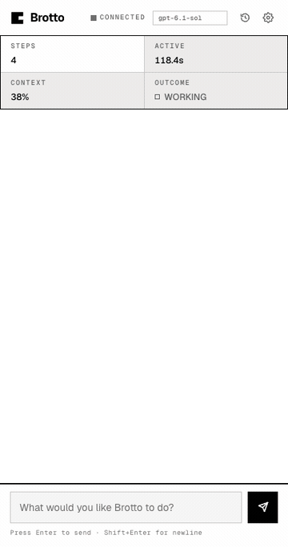
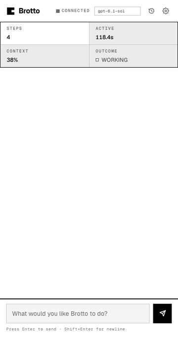
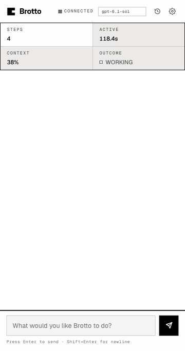

# Panel GIFs

Looping GIFs of the Brotto side panel showing each blocking card type: the
approval request, the clarifying question, and the sign-in wall. Each one opens
unanswered and resolves in place.





## Why these are not screenshots

The panels are rendered from the shipping extension. `build.mjs` reads
`clients/brotto-extension/src/sidepanel.html`, lifts its `<style>` block and body
markup verbatim, copies `sidepanel.js` beside them, and calls the panel's own
`appendApprovalCard` / `appendClarifyCard` / `appendLoginCard` / `resolveCard`
at load time. Nothing here draws a card — a mockup is an absence nobody
reviews, so a card that drifts from shipping is a card that is wrong.

`chrome-stub.js` stands down only the parts that would open a socket or touch
extension storage, so the real `sidepanel.js` loads unedited.

The animation crossfades between two snapshots of that real markup rather than
mutating the DOM mid-timeline, so frames can render in any order.

## Rendering

```bash
./render.sh
```

Needs `ffmpeg` on PATH and the pinned `hyperframes` version from `package.json`.
HyperFrames writes GIF directly; the ffmpeg pass re-palettises it, which is the
difference between a file that goes on a page and one that doesn't. It keeps the
native 400px width and the native 20fps — an earlier pass downscaled to 360 and
dropped to 15fps, which threw away the hairlines the design is made of and took
frames off the crossfade. Doubling the palette cost 40K. Output is 210–350K each.

Five rules in the generated HTML depart from the panel, each commented in
`build.mjs`: `#messages` is given the panel's own `--paper` so Chrome captures a
white backdrop behind the cards instead of a transparent one, `.grain` is hidden
(its 1.5% noise is invisible at GIF scale and costs ~4× the file size), and the
two perpetual animations — the sign-in badge pulse and the model pill's marquee —
are stopped, since a 6s loop has no room for a cycle nobody reads at GIF speed.

The fifth is a trap worth knowing about. The crossfading layers are stacked with
`position: absolute`, not by turning `#messages` into a grid — `.message.user`
and `.message.assistant` are placed with `align-self`, which means the **block**
axis in a grid, so a grid-ised `#messages` silently drops the user's bubble off
the right edge and the two turns read as one column. Each scene re-declares the
list layout it needs with `flex-direction: inherit`, `gap: inherit` and
`padding: inherit`, so the panel's own spacing is what positions them.

## What is and isn't verified

The compositions were opened in a real Chrome and checked against
`getBoundingClientRect` — the user's bubble sits flush right, the agent's flush
left, the card spans the content box — and both the unanswered and settled states
were screenshotted from the emitted GIFs.

What is *not* verified is the panel in a real Chrome side panel, which is
narrower than 400px and inherits the host's chrome. Opening `login.html` in a
browser is the closest equivalent, and it is how the two panel defects these
GIFs surfaced got found: a `.login-required-badge` that was built and never
appended, and a `fitModelPill` that added the handoff padding to a width that
already contained it, so every model name marqueed.